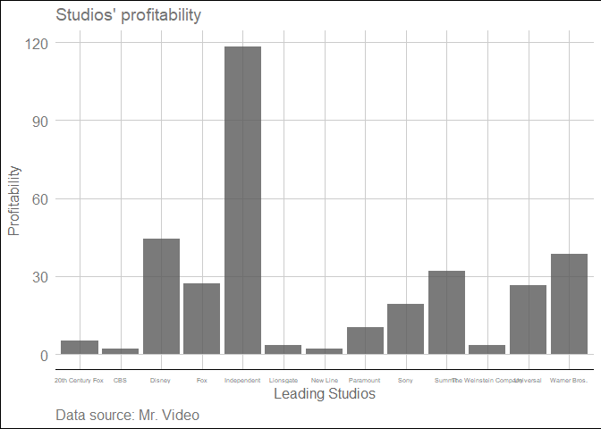

Readme
================

# Purpose

The purpose of this readme is to explain the code and structure in
completing the assessment for the first part of the data science course.
This readme outlines the data, packages and codes used and guides the
reader as to how each question of the assessment was answered. Each
question is answered in a separate project.

To get started, the different projects was created for question 1,
question 2 and question 3. The following code was used:

# Question 1

This question addresses some claims a friend made regarding movie
critics that perfectly predict films’ popularity and profitability
amongst audiences. This was not the case during the mid 2000s. This
question tests some of the friend’s theories by addressing three of the
statements she made.

The following packages were used:

``` r
pacman::p_load(tidyverse, ggthemes)
```

## Loading in data

The data for each question has been unzipped and put under the data
folder of each question folder. The data for the first question consists
of a csv file. This file contains information on the name of various
movies, the year during which the movie was released, each movie’s
production studio, its audience score and Rotten Tomatoes score, as well
as the profitability of the movie. The data was loaded as follows:

``` r
MovieData <- read.csv("Question1/data/Movies.csv")
```

## The first statement

The first statement my friend made is: “I firmly remember that Rotten
Tomatoes was always a great review platform - and if a movie had a
rating of more than 80% on Rotten Tomatoes, audiences would rate it
above 85% every time.”

To address this point, I drew a graph that indicates the ratings
audiences gave movies that had a rating of more than 80% on Rotten
Tomatoes. This was done by creating a function called RottenT\_plot that
draws the graph using only the movies that had a Rotten Tomatoes score
above 80%. This function is stored in the code folder of the question 1
folder. This function was then sourced in and the relevant input was
provided to produce the graph.

The movies were grouped into their relative genres to make it easier to
see what the rating of audiences were. This graph indicates that
animation movies that had a rating of more than 80% on Rotten Tomatoes,
had audience scores above 85%. Therefore, for animation movies, my
friend’s statement is true. However, for all the other genres my
friend’s statement is not true since the audience scores were below 85%.
Therefore, my friend’s statement regarding movies having high audience
scores if they have a high Rotten Tomatoes score is incorrect.

``` r
source("Question1/code/RottenT_plot.R")
graph_1 <- RottenT_plot(MovieData, xaxis_size = 5, xaxis_rows = 3)
graph_1
```

<!-- -->

## The second statement

The second statement my friend made is: “Disney films may not have the
highest grossing numbers, but they’ve always been the most profitable of
all the leading studios.”

To test this statement, a graph containing the profitability of all the
leading studios were drawn to compare the profitability across studios.
A bar plot was used.

This graph indicates that Independent was the most profitable studio
between 2007 and 2011, as it had the highest profitability (just under
120%). Disney’s profitability was around 40% which is much lower than
that of Independent. Therefore, my friend’s second statement is
incorrect.

``` r
source("Question1/code/Profitability_plot.R")
graph_2 <- Profitability_plot(MovieData, xaxis_size = 10, xaxis_rows = 10)
graph_2
```

<!-- -->

## The third statement

The second statement my friend made is: “Audiences are always drawn to
the highest grossing films. In fact, I bet the correlation between the
world wide grossing numbers and audience scores would be near 80%.”

To test this statement, the correlation between the world wide grossing
numbers and audience scores was calculated. The code for this is shown
below.

``` r
Corr <- 
  MovieData %>%  
  summarise(Corr = cor(Worldwide.Gross, Audience..score.., method = "spearman", use = "pairwise.complete.obs"))

#Corr <- MovieData %>% filter(price > 10) %>% group_by(taster_name) %>% summarise(Corr = cor(price, points, method = "spearman", use = "pairwise.complete.obs"))
```

The correlation between world wide grossing numbers and audience scores
is (29.1%).

# Question 2

# Question 3

For this question, the answers have been presented in a Texevier pdf.
